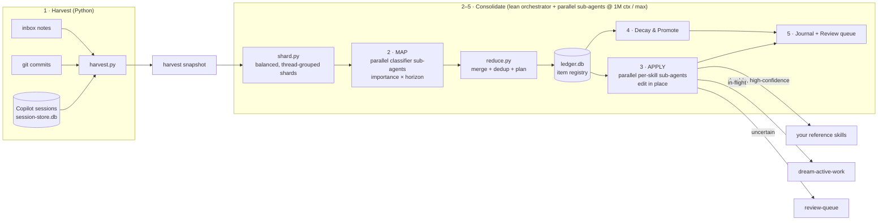

# Copilot Dream 💤

**A nightly, unattended "memory consolidation" pass for the [GitHub Copilot CLI](https://docs.github.com/copilot/how-tos/use-copilot-agents/use-copilot-cli).**

While you're away, Copilot Dream reads the day's Copilot-CLI sessions and git activity, then refines a set
of personal **skills** so that both Copilot CLI *and* VS Code Copilot Chat get progressively better context
over time — **without** polluting long-term knowledge with one-off noise, and **without** bloating the
context window.

> The name is the idea: it runs while you sleep and consolidates the day, the way sleep consolidates memory.
> Under the hood it's plain, auditable Python + PowerShell + Markdown — no magic, no external service.

---

## Why

Every Copilot session produces useful, durable facts (architecture, conventions, runbooks, cluster/endpoint
mappings) mixed with throwaway detail (a one-off error, a scratch resource, a personal side-quest). Curating
that by hand is high-friction and easy to skip; left alone, your skills either go stale or bloat. Copilot
Dream automates the curation:

- **Keeps** durable knowledge (routes it to the right reference skill, in place, deduped).
- **Tracks** in-flight work separately, with automatic decay.
- **Drops** noise — and records what it dropped so pruning stays auditable.

### Prior art (this is a known pattern)
- **Human sleep consolidation** — replay the day, keep the salient, prune the rest.
- **Letta "sleep-time compute" (2025)** — agents use idle time to reorganize memory instead of doing it inline.
- **Stanford "Generative Agents" (2023)** — a memory stream with an **importance score (1–10)** + periodic **reflection**. Copilot Dream uses the same importance + reflection idea.

---

## How it works — 5 layers



1. **Harvest** — deterministic Python collects the day's sessions + git commits + inbox notes into a compact snapshot, then `shard.py` splits it into balanced, thread-grouped shards.
2. **Classify (MAP)** — **parallel classifier sub-agents** (one per shard) score each candidate: `importance 1–10`, `horizon {long | short | drop}`, `domain`, `confidence`, `target`. `reduce.py` merges + dedups their output.
3. **Consolidate (APPLY)** — **parallel per-skill sub-agents** edit your target skills **in place** (dedup, never blind-append).
4. **Decay & Promote** — recurring short-term facts graduate to long-term; stale ones are archived out.
5. **Journal + Review** — a dated journal + a review queue you skim in ~2 minutes.

**Three things make it work well** (details in [docs/](docs/)):
- **A fingerprinted ledger** → idempotence (no double-apply), **promotion** (a fact seen on ≥3 distinct days *earns* long-term status), and **decay** (in-flight items untouched for ~14 days are archived). This is the anti-pollution core.
- **A thin, always-on index skill** (`dream`) that only *routes*; detail lives in skills loaded **on demand**. So the always-relevant context footprint stays tiny.
- **A lean map-reduce orchestrator** → the nightly run fans work out to ephemeral, fresh-context sub-agents (one per shard to classify, one per skill to edit) and itself only ever holds compact JSON — never a full day of raw sessions. Quality stays high because no single agent has to wade through a heavy day, the known failure mode where agents degrade well before filling their context window.

---

## Requirements

- **[GitHub Copilot CLI](https://docs.github.com/copilot/how-tos/use-copilot-agents/use-copilot-cli)**, authenticated (`copilot` on PATH).
- **Python 3** on PATH (standard library only — no `pip install`).
- **Windows + PowerShell 5.1+** for the runner/health-check/scheduling. (The Python harvester + ledger are cross-platform; the PowerShell pieces run on PowerShell 7 too, but the Task Scheduler integration is Windows.)
- *Recommended:* **Microsoft Scout** (a.k.a. **ClawPilot**), a Windows agentic-automation app, to schedule the
  run, post a morning digest to Teams, and let you approve/reject the review queue by replying in plain English.
  Import-ready automations ship in `engine/triggers/scout-*.example.json`. Not required — **Windows Task
  Scheduler** (or `cron`) is the no-Scout fallback.

---

## Quick start

```powershell
# 1. clone
git clone https://github.com/bhanuprakash-1/copilot-dream.git
cd copilot-dream

# 2. install into ~/.copilot (copies engine + skill templates, inits the ledger, creates your config)
powershell -NoProfile -ExecutionPolicy Bypass -File .\install\install.ps1

# 3. edit your config (identity, repo roots, which reference skills to feed, keywords)
notepad $env:USERPROFILE\.copilot\dream\config.json     # see engine/config.example.json + examples/

# 4. see what a run WOULD harvest — no model spend, no writes
powershell -File $env:USERPROFILE\.copilot\dream\run-dream.ps1 -DryRun

# 5. a safe first run: proposes everything to a review queue, edits NO skills
powershell -File $env:USERPROFILE\.copilot\dream\run-dream.ps1 -ProposeOnly

# 6. once you trust it, a real applying run
powershell -File $env:USERPROFILE\.copilot\dream\run-dream.ps1

# 7. schedule it nightly (runs in your logged-on/idle session)
powershell -File $env:USERPROFILE\.copilot\dream\triggers\install-scheduled-task.ps1
```

> Prefer a morning digest + review you can drive in plain English? Import the **Microsoft Scout (ClawPilot)**
> automations in `engine/triggers/scout-*.example.json` (Scout → **Automations → Import**): you get a Teams
> digest and an interactive thread where you approve/reject the review queue in plain English. Task Scheduler
> above is the no-Scout fallback. See [docs/05-install-and-schedule.md](docs/05-install-and-schedule.md).

**Verify any morning** (10-second health check):
```powershell
powershell -File $env:USERPROFILE\.copilot\dream\dream-status.ps1     # GREEN / YELLOW / RED
```

**Feed it a note** anytime (all land in `inbox.md`, classified next run):
```powershell
powershell -File $env:USERPROFILE\.copilot\dream\dream-note.ps1 "track the acme-api rollout as an active thread"
```
…or just tell any Copilot session: *"add a dream note: …"*.

**Review in plain English** — reply in the Scout digest thread (`approve <slug>`, `reject <slug>`, `track …`),
or run the same natural-language operator from a terminal:
```powershell
copilot -p $env:USERPROFILE\.copilot\dream\dream-action.prompt.md "reject the deadlock note and approve the cilium one"
```
Both call the deterministic helpers — `dream-approve.ps1` (record an approved edit), `dream-reject.ps1`
(permanent veto), `dream-note.ps1` (drop a note). See [docs/07-operations-and-maintenance.md](docs/07-operations-and-maintenance.md#reviewing--approvingrejecting-knowledge).

---

## What it edits (and what it never touches)

- **It edits *your* skills** under `~/.copilot/skills/` — the ones you point it at in `config.json`, plus the
  `dream` index and `dream-active-work` short-term skill it ships. Edits are in place, deduped, and it
  **never deletes your prose** (archival = review-queue or a ledger mark, not silent deletion).
- **Runtime state stays local and git-ignored**: `config.json`, `ledger.db`, `journal/`, `review-queue/`,
  `harvest/`, `logs/`, `state.json`, `inbox.md`. Your personal knowledge is **never** committed by this repo.
- It never writes secrets/PII into a skill, even if present in a session.

---

## Repo layout

| Path | What |
|---|---|
| `engine/` | The system: `harvest.py`, `shard.py`, `reduce.py`, `ledger.py`, `run-dream.ps1`, `dream-status.ps1`, `dream-note.ps1`, `dream-approve.ps1`, `dream-reject.ps1`, `dream-action.prompt.md`, `dream-consolidation.prompt.md`, `config.example.json`, `triggers/` (incl. `scout-*.example.json`). |
| `skills/` | Template skills installed for you: `dream` (thin index/router) + `dream-active-work` (short-term). |
| `install/install.ps1` | Idempotent bootstrap into `~/.copilot`. |
| `examples/` | A filled example config + a synthetic journal showing the output. |
| `docs/` | Deep dives — architecture, data model, algorithm, skills, install/schedule, adopting, operations. |

## Configuration & model

Everything tunable lives in `engine/config.example.json` (copied to `~/.copilot/dream/config.json`): identity,
harvest sources + repo roots, domain keywords, the reference skills to feed, thresholds (promotion,
decay, auto-apply confidence), and the `map_reduce` parallelism caps (shard size, max shards, max parallel
applies). The runner defaults to a long-context, high-reasoning model (`claude-opus-4.8` or `gpt-5.6-sol`,
at 1M context / max effort) — change the allowed set in `run-dream.ps1` and `config.json` if you prefer
another.

## Docs

- [docs/01-architecture.md](docs/01-architecture.md) · [02-data-model](docs/02-data-model.md) · [03-consolidation-algorithm](docs/03-consolidation-algorithm.md)
- [docs/04-skills-reference.md](docs/04-skills-reference.md) · [05-install-and-schedule](docs/05-install-and-schedule.md) · [06-sharing-guide](docs/06-sharing-guide.md) · [07-operations-and-maintenance](docs/07-operations-and-maintenance.md)

## Contributing

New input sources (VS Code chat, PR history, issues, chat platforms) plug into `harvest.py` and
`config.json → sources` — the classifier and ledger are source-agnostic. See [CONTRIBUTING.md](CONTRIBUTING.md).

## License

[MIT](LICENSE).
