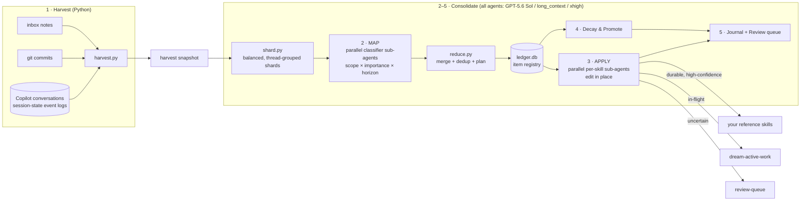

# Copilot Dream 💤

**A nightly, unattended "memory consolidation" pass for the [GitHub Copilot CLI](https://docs.github.com/copilot/how-tos/use-copilot-agents/use-copilot-cli).**

While you're away, Copilot Dream reads the day's Copilot-CLI conversations — your prompts, the agent's answers,
and the back-and-forth between them — plus git activity, then refines a set
of personal **skills** so that both Copilot CLI *and* VS Code Copilot Chat get progressively better context
over time — **without** polluting long-term knowledge with one-off noise, and **without** bloating the
context window.

> The name is the idea: it runs while you sleep and consolidates the day, the way sleep consolidates memory.
> Under the hood it's plain, auditable Python + PowerShell + Markdown — no magic, no external service.

---

## Why

Copilot sessions are a mix of durable facts (architecture, conventions, runbooks, cluster/endpoint
mappings) and throwaway detail (a one-off error, a scratch resource, a personal side-quest) — and some
sessions are pure noise with nothing worth keeping at all. Curating
that by hand is high-friction and easy to skip; left alone, your skills either go stale or bloat. Copilot
Dream automates the curation:

- **Keeps** durable knowledge (routes it to the right reference skill, in place, deduped).
- **Learns from the conversation** — questions you asked and the answers that held up, corrections you made,
  preferences you stated — not just from the final result.
- **Tracks** in-flight work separately, with automatic decay. Learnings that outlive a feature go to your
  reference skills; only the feature's live status stays in short-term memory.
- **Keeps each skill at its own altitude** — instance detail (PR numbers, resource names, one handler's bug)
  only lands in a skill that is about exactly that; skills over their size budget are tightened, not grown.
- **Shows its work, and lets you undo it** — every run is bracketed by snapshots of your skills folder, and a
  per-run report lists every skill edited and every section added, rewritten or removed, with the exact lines
  and a one-command revert per skill.
- **Drops** noise — and records what it dropped so pruning stays auditable.

### Prior art (this is a known pattern)
- **Human sleep consolidation** — replay the day, keep the salient, prune the rest.
- **Letta "sleep-time compute" (2025)** — agents use idle time to reorganize memory instead of doing it inline.
- **Stanford "Generative Agents" (2023)** — a memory stream with an **importance score (1–10)** + periodic **reflection**. Copilot Dream uses the same importance + reflection idea.

---

## How it works — 5 layers


```mermaid
flowchart LR
    subgraph H["1 · Harvest (Python)"]
      S1[(Copilot conversations<br/>session-state event logs)] --> HV[harvest.py]
      S2[git commits] --> HV
      S3[inbox notes] --> HV
    end
    HV --> SN[harvest snapshot]
    SN --> SH[shard.py<br/>balanced, thread-grouped shards]
    subgraph C["2–5 · Consolidate (all agents: GPT-5.6 Sol / long_context / xhigh)"]
      SH --> MAP[2 · MAP<br/>parallel classifier sub-agents<br/>scope × importance × horizon]
      MAP --> RD[reduce.py<br/>merge + dedup + plan]
      RD --> LG[(ledger.db<br/>item registry)]
      LG --> AP[3 · APPLY<br/>parallel per-skill sub-agents<br/>edit in place]
      LG --> DP[4 · Decay & Promote]
      AP --> JR[5 · Journal + Review queue]
      DP --> JR
    end
    AP -->|durable, high-confidence| REF[your reference skills]
    AP -->|in-flight| ACT[dream-active-work]
    AP -->|uncertain| RQ[review-queue]
```

1. **Harvest** — deterministic Python rebuilds each session's conversation from the CLI event log (your prompts, the agent's commentary and final answers, compaction summaries — only what is new since the last run), adds git commits + inbox notes, then `shard.py` splits it into balanced, thread-grouped shards.
2. **Classify (MAP)** — **parallel classifier sub-agents** (one per shard) mine the back-and-forth and score each candidate: `scope {feature | topic | cross-cutting}`, `importance 1–10`, `horizon {long | short | drop}`, `domain`, `confidence`, `target`. `reduce.py` merges + dedups their output and enforces scope: feature status → short-term memory, durable learnings → reference skills.
3. **Consolidate (APPLY)** — **parallel per-skill sub-agents** edit your target skills **in place** (dedup, never blind-append, never grow a skill that is over budget).
4. **Decay & Promote** — recurring short-term facts graduate to long-term; stale ones are archived out.
5. **Journal + Review** — a dated journal + a review queue you skim in ~2 minutes.

**Three things make it work well** (details in [docs/](docs/)):
- **A fingerprinted ledger** → idempotence (no double-apply), **promotion** (a fact seen on ≥3 distinct days *earns* long-term status), and **decay** (in-flight items untouched for ~14 days are archived). This is the anti-pollution core.
- **A thin, always-on index skill** (`dream`) that only *routes*; detail lives in skills loaded **on demand**. So the always-relevant context footprint stays tiny.
- **A lean map-reduce orchestrator** → the nightly run fans work out to ephemeral, fresh-context sub-agents (one per shard to classify, one per skill to edit) and itself only ever holds compact JSON — never a full day of raw sessions. Quality stays high because no single agent has to wade through a heavy day, the known failure mode where agents degrade well before filling their context window.

---

## Requirements

- **[GitHub Copilot CLI](https://docs.github.com/copilot/how-tos/use-copilot-agents/use-copilot-cli)**, authenticated (`copilot` on PATH).
- **Python 3** on PATH (standard library only — no `pip install`).
- **Windows + PowerShell 5.1+** for the runner/health-check/scheduling. (The Python harvester + ledger are cross-platform; the PowerShell pieces run on PowerShell 7 too, but the Task Scheduler integration is Windows.)
- *Recommended:* **Microsoft Scout** (a.k.a. **ClawPilot**), a Windows agentic-automation app, to schedule the
  run, post a morning digest to Teams, and let you approve/reject the review queue by replying in plain English.
  Import-ready automations ship in `engine/triggers/scout-*.example.json`. Not required — **Windows Task
  Scheduler** (or `cron`) is the no-Scout fallback.

---

## Quick start

```powershell
# 1. clone
git clone https://github.com/bhanuprakash-1/copilot-dream.git
cd copilot-dream

# 2. install into ~/.copilot (copies engine + skill templates, inits the ledger, creates your config)
powershell -NoProfile -ExecutionPolicy Bypass -File .\install\install.ps1

# 3. edit your config (identity, repo roots, which reference skills to feed, keywords)
notepad $env:USERPROFILE\.copilot\dream\config.json     # see engine/config.example.json + examples/

# 4. see what a run WOULD harvest — no model spend, no writes
powershell -File $env:USERPROFILE\.copilot\dream\run-dream.ps1 -DryRun

# 5. a safe first run: proposes everything to a review queue, edits NO skills
powershell -File $env:USERPROFILE\.copilot\dream\run-dream.ps1 -ProposeOnly

# 6. once you trust it, a real applying run
powershell -File $env:USERPROFILE\.copilot\dream\run-dream.ps1

# replay a preserved applying-mode work order after an interrupted run
powershell -File $env:USERPROFILE\.copilot\dream\run-dream.ps1 -ReplayPlan <pending-apply-plan.json>

# 7. schedule it nightly (runs in your logged-on/idle session)
powershell -File $env:USERPROFILE\.copilot\dream\triggers\install-scheduled-task.ps1
```

> Prefer a morning digest + review you can drive in plain English? Import the **Microsoft Scout (ClawPilot)**
> automations in `engine/triggers/scout-*.example.json` (Scout → **Automations → Import**): you get a Teams
> digest and an interactive thread where you approve/reject the review queue in plain English. Task Scheduler
> above is the no-Scout fallback. See [docs/05-install-and-schedule.md](docs/05-install-and-schedule.md).

**Verify any morning** (10-second health check):
```powershell
powershell -File $env:USERPROFILE\.copilot\dream\dream-status.ps1     # GREEN / YELLOW / RED
```

**Feed it a note** anytime (all land in `inbox.md`, classified next run):
```powershell
powershell -File $env:USERPROFILE\.copilot\dream\dream-note.ps1 "track the acme-api rollout as an active thread"
```
…or just tell any Copilot session: *"add a dream note: …"*.

**Review in plain English** — reply in the Scout digest thread (`approve <slug>`, `reject <slug>`, `track …`),
or run the same natural-language operator from a terminal:
```powershell
copilot -p $env:USERPROFILE\.copilot\dream\dream-action.prompt.md "reject the deadlock note and approve the cilium one"
```
Both call the deterministic helpers — `dream-approve.ps1` (record an approved edit), `dream-reject.ps1`
(permanent veto), `dream-note.ps1` (drop a note). See [docs/07-operations-and-maintenance.md](docs/07-operations-and-maintenance.md#reviewing--approvingrejecting-knowledge).

---

## What it edits (and what it never touches)

- **It edits *your* skills** under `~/.copilot/skills/` — the ones you point it at in `config.json`, plus the
  `dream` index and `dream-active-work` short-term skill it ships (and, if you've configured no long-term
  skills, a single auto-seeded `knowledge-base` skill). Edits are in place, deduped, and it **never deletes
  your prose** (archival = review-queue or a ledger mark, not silent deletion). A skill over its size budget
  is only tightened (duplicates merged, wording shortened, no fact lost); when `dream-active-work` outgrows
  its budget it is compacted and the removed text is archived under `~/.copilot/dream/archive/`.
- **It reads your repos, never edits them.** If you point `read_only_context` at your repos' agent guidance
  (`.github/copilot-instructions.md`, `AGENTS.md`, in-repo skills), the Dream consults them **read-only** to
  align with each repo's conventions and defers repo-owned knowledge to the repo — it never modifies anything
  inside your repositories.
- **Runtime state stays local and git-ignored**: `config.json`, `ledger.db`, `journal/`, `review-queue/`,
  `completion/`, `pending/`, `harvest/`, `logs/`, `archive/`, `changes/`, `skills-history.git/`, `state.json`,
  `inbox.md`. Your personal knowledge is
  **never** committed by this repo.
- It never writes secrets/PII into a skill, even if present in a session.

## See (and undo) exactly what changed

Every run is bracketed by two snapshots of your skills folder in a local git history
(`~/.copilot/dream/skills-history.git`, kept outside the skills folder and never pushed). The Dream's own edits
are told apart from anything else that changed meanwhile using the Copilot CLI's per-session edit log, so an
edit you make while a run is in flight is listed separately and never blamed on (or reverted with) the run.
After each run, `skillaudit.py` writes `~/.copilot/dream/changes/<date>-<run>.md`: every skill the run edited,
the sections it added, rewrote or removed, and the exact lines, next to the applier's own reason for each merge
or tightening. A summary table is appended to the journal and surfaced by `dream-status.ps1` (and the morning
digest). Skills you list in `targets.watched_skills` are always listed first, and a rewrite or removal in one
of them turns the status YELLOW.

```powershell
python ~/.copilot/dream/skillaudit.py runs                                       # recent runs, what each changed
python ~/.copilot/dream/skillaudit.py show    --run last --skill <name>          # the exact diff
python ~/.copilot/dream/skillaudit.py revert  --run last --skill <name> --check  # preview undoing it
python ~/.copilot/dream/skillaudit.py revert  --run last --skill <name>          # undo that run's change
python ~/.copilot/dream/skillaudit.py undo-revert                                # undo the latest revert (files + ledger)
python ~/.copilot/dream/skillaudit.py restore --skill <name> --to <commit>       # any recorded state
python ~/.copilot/dream/skillaudit.py log     --skill <name>                     # full history of a skill
```

Revert is a three-way merge: it removes only what that run changed and keeps later edits, yours or later
runs'. If a later edit touched the same lines it changes nothing and names the run to revert first; `--restore`
resets the file to its state before the Dream's edits instead (the later edits stay in history). Writing
commands refuse while a Dream run is in progress. Edits you make between runs, and approvals, are committed to
the same history. In the digest thread you can just ask: *"what changed in X?"*, *"revert X"*.

---

## Repo layout

| Path | What |
|---|---|
| `engine/` | The system: `harvest.py`, `shard.py`, `reduce.py`, `ledger.py`, `skillaudit.py`, `run-dream.ps1`, `resolve-model-policy.ps1`, `dream-status.ps1`, `dream-note.ps1`, `dream-approve.ps1`, `dream-reject.ps1`, `dream-action.prompt.md`, `dream-consolidation.prompt.md`, `config.example.json`, `triggers/` (incl. `scout-*.example.json`). |
| `skills/` | Template skills installed for you: `dream` (thin index/router) + `dream-active-work` (short-term). |
| `install/install.ps1` | Idempotent bootstrap into `~/.copilot`. |
| `examples/` | A filled example config + a synthetic journal showing the output. |
| `docs/` | Deep dives — architecture, data model, algorithm, skills, install/schedule, adopting, operations. |

## Configuration & model

Everything tunable lives in `engine/config.example.json` (copied to `~/.copilot/dream/config.json`): identity,
harvest sources + repo roots, domain keywords, the reference skills to feed (plus a `general_skill` for
cross-cutting learnings), thresholds (promotion, decay, auto-apply confidence, per-skill size budgets), the
`map_reduce` parallelism caps (shard size, max shards, max parallel applies), the `runner` block (the
headless run disables every MCP server — the Dream needs only local tools — and retries an attempt that
applied nothing), and the `history` block (skill snapshots and change reports). `config.model_policy` pins the cost-conscious model (currently `gpt-5.6-sol`) and sets
`long_context` (~1M tier) with `xhigh` reasoning for the orchestrator and every sub-agent/retry.
`resolve-model-policy.ps1` rejects models outside the allow-list, default context, and effort below
`xhigh`. Change this cost-conscious pin only when the user explicitly requests it; never silently fall back.

### Point it at your repos' agent guidance (read-only)
Set `read_only_context.agent_instruction_globs` and `read_only_context.repo_skill_dirs` to your repos'
`.github/copilot-instructions.md`, `AGENTS.md`, `.github/instructions/*.md`, and in-repo skills directories.
Each night a classifier reads the file(s) matching a shard's repo **read-only**, so extracted knowledge aligns
with that repo's conventions and repo-owned knowledge is *deferred to the repo* instead of being copied into
your personal skills. Non-existent paths are skipped, and **the Dream never edits your repos.**

### Zero-config start (seeding)
You don't have to define any reference skills up front. Leave `targets.long_term_skills` **empty** and the
Dream still works: it ensures the `dream` index and `dream-active-work` skills exist and seeds a single
`knowledge-base` skill, routing durable facts there. As recurring topics emerge it **proposes** dedicated
skills to the review-queue for you to approve — it *proposes, you approve,* and **never auto-creates**
dedicated skills. Once you have any long-term skill, seeding is a no-op.

## Docs

- [docs/01-architecture.md](docs/01-architecture.md) · [02-data-model](docs/02-data-model.md) · [03-consolidation-algorithm](docs/03-consolidation-algorithm.md)
- [docs/04-skills-reference.md](docs/04-skills-reference.md) · [05-install-and-schedule](docs/05-install-and-schedule.md) · [06-sharing-guide](docs/06-sharing-guide.md) · [07-operations-and-maintenance](docs/07-operations-and-maintenance.md)

## Contributing

New input sources (VS Code chat, PR history, issues, chat platforms) plug into `harvest.py` and
`config.json → sources` — the classifier and ledger are source-agnostic. See [CONTRIBUTING.md](CONTRIBUTING.md).

## License

[MIT](LICENSE).
