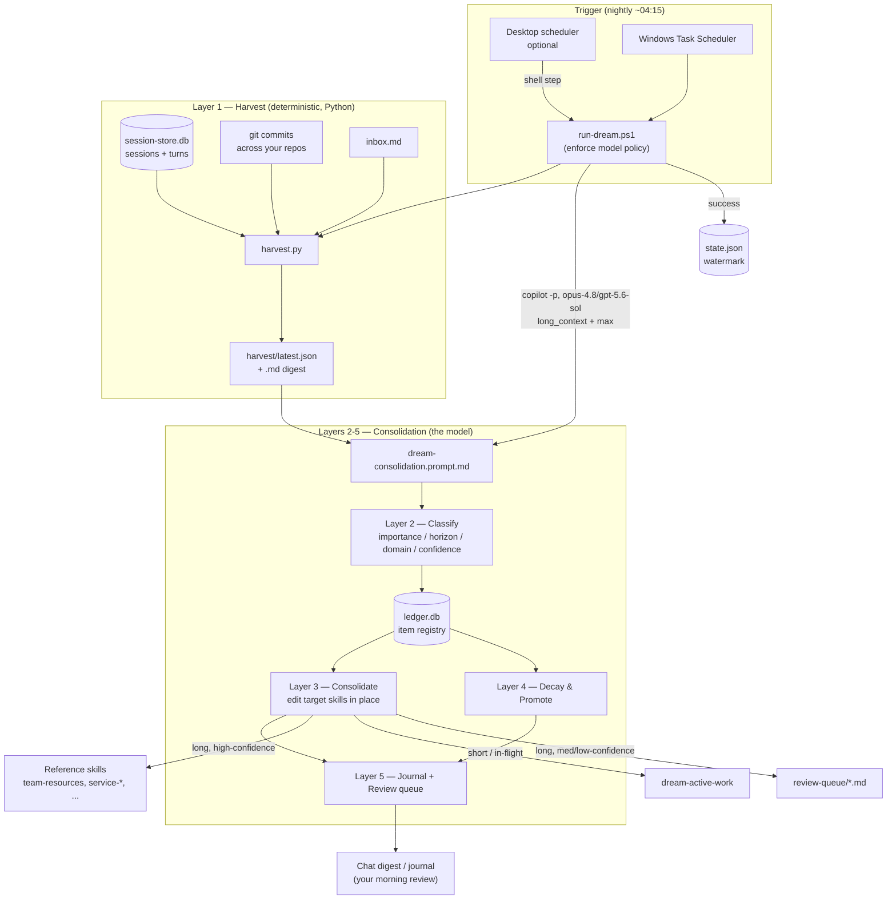

# 01 — Architecture

## Design goals
1. **Automated & unattended** — runs in a quiet overnight window (e.g. ~04:00–10:30) with no interaction.
2. **Long-term + short-term** — durable knowledge *and* current in-flight work, kept separate.
3. **No pollution** — one-off/trivial detail must never enter long-term skills.
4. **No context bloat** — a thin always-on index; detail loads only on demand.
5. **Reusable everywhere** — the outputs are skills, readable by Copilot CLI *and* VS Code Copilot Chat.
6. **Extensible** — new input sources (VS Code chat, pull-request history, chat/email) plug in without redesign.
7. **Reviewable** — you review and correct; the system respects your edits.

## Control flow

## Why this structure

### Deterministic harvest, probabilistic consolidation
The **harvest is code** (Python over SQLite + git) so it's cheap, reproducible, and never hallucinates the
inputs. The **consolidation is the model** because classification/dedup/refinement need judgment. The model
never has to *find* the raw material — `harvest.py` hands it a compact snapshot.

### The ledger is what prevents pollution and enables decay
A plain LLM pass each night would re-derive everything and drift. The **ledger** (`ledger.db`) gives the
system memory *about its own memory*: every candidate is fingerprinted and counted. That yields three
properties a stateless pass can't have:
- **Idempotence** — re-running a night doesn't double-apply (fingerprints dedup).
- **Promotion** — a fact seen on ≥3 distinct days graduates from short-term to long-term (recurrence = durability).
- **Decay** — an in-flight thread untouched for 14 days is archived out of active context automatically.

### Two horizons, two homes
| Horizon | Home | Lifecycle |
|---|---|---|
| **Long-term** (architecture, topology, playbooks, repo map, conventions) | reference skills (`team-resources`, `service-architecture`, `deployment-runbook`, `telemetry-queries`, …) | refined in place, deduped, rarely removed |
| **Short-term** (active feature, open PR, ongoing investigation, live finding) | `dream-active-work` | refreshed while active, archived on decay |
| **Noise** (one-off bug, machine chatter, off-domain personal, automation transcripts) | *dropped* | never written |

### Model policy
Only `claude-opus-4.8` or `gpt-5.6-sol`, both `--context long_context` (1M) `--effort max`. The 1M window
lets the Dream hold a full day of sessions + all target skills at once; max reasoning is worth it for the
judgment-heavy classification. `run-dream.ps1` refuses any other model (PowerShell `ValidateSet`).

## Prior art / inspiration
This design borrows two well-known ideas:
- **Sleep-time compute** (popularized by the Letta / MemGPT project): let an agent do useful background work —
  summarizing, reorganizing, and consolidating memory — while it is otherwise idle, so the "awake" path stays
  fast and uncluttered.
- **Generative Agents** (Stanford, Park et al. 2023): a memory stream plus periodic *reflection* that distills
  many low-level observations into higher-level, durable takeaways.

The nightly Dream is essentially that reflection pass: a deterministic harvest gathers the day's raw
observations, then a consolidation pass distills them — promoting what recurs, decaying what goes stale, and
dropping noise.

## Trigger model (why it works while you're logged off the keyboard)
Your machine stays **logged on but idle** overnight (sleep is disabled). Because the interactive session is
alive, your mapped drives, repo roots, and your Copilot auth token are all available at ~04:15 — so either a
**Windows Scheduled Task** ("run only when logged on") or a **desktop automation app** whose shell step runs
`run-dream.ps1` works. Windows Task Scheduler is the portable default; a desktop automation app is an optional
alternative some people prefer because it can also post a morning chat digest. See
[05-install-and-schedule.md](05-install-and-schedule.md).

## Extensibility
New sources are added in `harvest.py` (`harvest_*` functions) and declared in `config.json → sources`.
The classifier and ledger are source-agnostic (each item carries a `source` tag). Candidates on the roadmap:
VS Code Copilot Chat transcripts, pull-request create/update history, incident tickets, chat/email threads.
