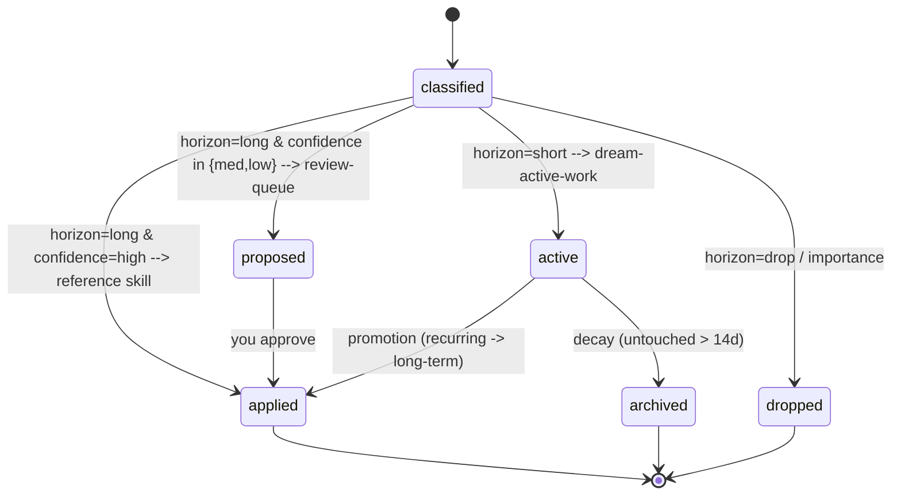

# 02 — Data Model

## Sources → snapshot (harvest.py)
Configured in `config.json → sources`. Each source is independent; one failing never aborts the run.

| Source | Where | What's captured |
|---|---|---|
| CLI sessions | `~/.copilot/session-store.db` (read-only) | `sessions` updated in window + their `turns` (user msg full, assistant truncated to 1.6 KB), plus `session_files`, `session_refs`. Empty sessions skipped. |
| Git commits | git roots under your configured repo roots (auto-detected) | commits authored by you (`git config user.email/name`) since the window, with `--name-only` file lists, `--no-merges`. |
| Inbox | `~/.copilot/dream/inbox.md` | freeform notes below the marker line. |

Output: `harvest/harvest-<stamp>.json` (machine) + `.md` (human) + `harvest/latest.json` (stable pointer).

### The harvest window (watermark)
`state.json` stores `last_run_utc`. Next window = `now − (hours_since_last_run + 1h margin)`, floored at
`window.default_hours` (30) and capped at `window.max_hours` (72). First run uses 30h. The watermark only
advances on a **successful** consolidation, so a failed night is retried (safely — the ledger dedups).

## Map-reduce artifacts (shard.py / reduce.py)
The consolidation runs as map-reduce (see [01-architecture](01-architecture.md)). Two deterministic
scripts create the intermediate files the orchestrator and its sub-agents hand off through. All of them
live in a per-run scratch dir `harvest/shards/<stamp>/` (stable pointer: `harvest/shards/latest.json`).

### shard.py — split the harvest for parallel classification
`python shard.py --config config.json` reads the harvest snapshot and writes:
| File | What |
|---|---|
| `shard-NN.json` | a mini-snapshot (a subset of sessions, or all git commits) that one MAP sub-agent reads. Sessions are grouped by `(repository, branch)` so a thread never splits across shards; groups are bin-packed to ~`map_reduce.target_tokens` each, capped at `map_reduce.max_shards`; git commits get their own shard. |
| `manifest.json` | the compact index the **orchestrator** reads (never the shard bodies): per shard — file, kind, session/commit counts, est_tokens, branches. |

### reduce.py — merge the MAP outputs and build the work order
- `python reduce.py --config config.json merge --in <shard_dir> --out candidates.json`
  concatenates every `claims-NN.json` (what the MAP sub-agents write), dedups by the same fingerprint the
  ledger uses, and **conservatively resolves cross-shard disagreement** — a claim two shards score
  differently is never auto-elevated to long/high; it is demoted toward active-work or review.
- `python reduce.py --config config.json plan --candidates candidates.json --out apply-plan.json`
  routes every candidate into the work order the APPLY phase consumes:

  | Bucket | Rule |
  |---|---|
  | `by_skill[<name>]` | `horizon=long` + `confidence=high` + `target` is a known reference skill → one APPLY sub-agent per skill |
  | `active_work.add` | `horizon=short` (or `target=dream-active-work`) |
  | `active_work.remove_decayed` | from `ledger.py decays` |
  | `review_queue` | `long` + med/low confidence, unroutable targets, or (importance ≥ 7) new-skill proposals |
  | `drops_count` | `horizon=drop` (already recorded by the upsert) |

  `plan` also folds in `ledger.py promotions` (recurring shorts that earned long-term status).

All of `shard-NN.json`, `claims-NN.json`, `candidates.json`, `apply-plan.json`, and `manifest.json` are
scratch — git-ignored, retained for the last ~10 nights by `run-dream.ps1`, and fully reproducible from
the harvest snapshot.

## Ledger schema (ledger.db)

### Table `items` — one row per durable candidate
| Column | Meaning |
|---|---|
| `fingerprint` (PK) | sha1 of the normalized claim text — the dedup/idempotence key. |
| `claim` | the durable, generally-worded fact/pattern/decision (never "what I did today"). |
| `domain` | your project/area tags, e.g. `acme-api` \| `platform` \| `dev-workflow` \| `off-domain`. |
| `horizon` | `long` \| `short` \| `drop`. |
| `importance` | 1–10 (would this help me in 6 months, in a different session?). |
| `confidence` | `high` \| `medium` \| `low` — gates auto-apply vs review-queue. |
| `target` | destination skill name, or `dream-active-work`, or `review-queue`. |
| `status` | `active` \| `applied` \| `proposed` \| `archived` \| `dropped`. |
| `hit_count` | times this claim has been seen (bumped on every re-sighting). |
| `distinct_days` | number of distinct days it's been seen (drives promotion). |
| `first_seen` / `last_seen` / `last_day` | timestamps for decay + distinct-day counting. |
| `source` | `sessions` \| `git` \| `inbox` \| `mixed`. |
| `evidence` | short pointer (session id prefix, commit hash, branch, inbox). |
| `notes` / `updated_at` | free notes; last write time. |

### Table `runs` — one row per nightly run
`run_id, started, finished, model, window_hours, harvested, dropped, applied, proposed, promoted, decayed, journal_path, status, notes`.

### Deterministic ledger operations (called by the Dream, not hand-written SQL)
```
python ledger.py init
python ledger.py stats
python ledger.py upsert --json items.json     # bumps hit_count / distinct_days for repeats
python ledger.py promotions                    # SHORT items with hit_count>=3 over >=3 distinct days
python ledger.py decays                         # active SHORT items past decay_days (14)
python ledger.py set-status --fingerprint F --status applied|proposed|archived|dropped|active
python ledger.py record-run --json run.json
python ledger.py dump [--status active] [--horizon short]
```

## Item lifecycle



Notes:
- **Drops are still recorded** (as `dropped`) so recurrence is tracked — if a "noise" item keeps recurring
  with rising importance, it can later be reconsidered rather than silently ignored forever.
- **Promotion** is the mechanism that keeps long-term skills earned, not guessed: only facts that recur
  across multiple days become durable.
- **Decay** keeps `dream-active-work` small; the durable lesson (if any) is promoted before archival.

## Thresholds (config.json → thresholds)
| Key | Default | Effect |
|---|---|---|
| `promote_hit_count` | 3 | min sightings to consider promotion |
| `promote_distinct_days` | 3 | min distinct days to consider promotion |
| `decay_days` | 14 | active short items older than this are archived |
| `auto_apply_min_confidence` | `high` | below this, long-term edits go to review-queue |
| `importance_keep_floor` | 4 | below this, drop unless part of an active thread |
