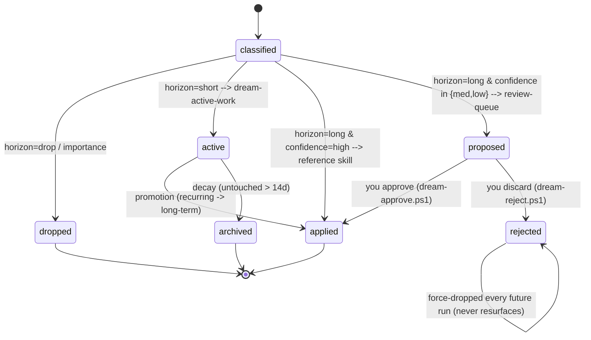

# 02 — Data Model

## Sources → snapshot (harvest.py)
Configured in `config.json → sources`. Each source is independent; one failing never aborts the run.

| Source | Where | What's captured |
|---|---|---|
| CLI sessions | `~/.copilot/session-store.db` (read-only) + `~/.copilot/session-state/<id>/events.jsonl` | Sessions updated in the window. Each one's **main-thread conversation** is rebuilt from its event log: every user prompt, the agent's `interim` commentary and `final` answers (with the tools it ran in that turn), compaction `summary` entries, delegated sub-agent tasks and skills used. Only entries newer than the window start are kept (a long-running session is not re-classified in full each night); `prior_context` (the last earlier compaction summary, or the opening prompt) orients the classifier. Sub-agent internals, injected skill bodies, system notifications and bare slash commands are excluded, obvious secrets are redacted, and each session is capped at `session_budget_chars` (commentary is trimmed first). Sessions without an event log fall back to the store's `turns` + `checkpoints`. `session_files` / `session_refs` are window-filtered too. |
| Git commits | git roots under your configured repo roots (auto-detected) | commits authored by you (`git config user.email/name`) since the window, with `--name-only` file lists, `--no-merges`. |
| Inbox | `~/.copilot/dream/inbox.md` | freeform notes below the marker line. Notes persist until you delete them and act as standing guidance: every MAP and APPLY sub-agent reads them each night. |

Output: `harvest/harvest-<stamp>.json` (machine) + `.md` (human) + `harvest/latest.json` (stable pointer).

### The harvest window (watermark)
`state.json` stores `last_run_utc` — the successful run's harvest **cutoff** (taken before any source is read,
not when the run finished, so sessions updated while it ran fall inside the next window). The next window
starts at that cutoff minus `window.overlap_minutes` (15 — events can reach disk shortly after their
timestamp), capped at `window.max_hours` (168, so a multi-night outage is recovered on the next good run).
Only a first run uses `window.default_hours` (30). Within a session only entries newer than the window start
are harvested, so the same conversation is not re-classified night after night. The watermark only
advances when both the dated journal and the final `completion/run-<date>-<session>.json` marker were
written during the run. Copilot process exit code 0 alone is not success. A failed night therefore leaves
the watermark untouched and is retried (safely — the ledger dedups).

## Map-reduce artifacts (shard.py / reduce.py)
The consolidation runs as map-reduce (see [01-architecture](01-architecture.md)). Two deterministic
scripts create the intermediate files the orchestrator and its sub-agents hand off through. All of them
live in a per-run scratch dir `harvest/shards/<stamp>/` (stable pointer: `harvest/shards/latest.json`).

### shard.py — split the harvest for parallel classification
`python shard.py --config config.json` reads the harvest snapshot and writes:
| File | What |
|---|---|
| `shard-NN.json` | a mini-snapshot (a subset of sessions, or all git commits) that one MAP sub-agent reads. Sessions are grouped by `(repository, branch)` so a thread never splits across shards; groups are bin-packed to ~`map_reduce.target_tokens` each, capped at `map_reduce.max_shards`; git commits get their own shard. |
| `manifest.json` | the compact index the **orchestrator** reads (never the shard bodies): per shard — file, kind, session/commit counts, est_tokens, branches. |

### reduce.py — merge the MAP outputs and build the work order
- `python reduce.py --config config.json merge --in <shard_dir> --out candidates.json`
  concatenates every `claims-NN.json` (what the MAP sub-agents write), dedups by the same fingerprint the
  ledger uses, and **conservatively resolves cross-shard disagreement** — a claim two shards score
  differently is never auto-elevated to long/high; it is demoted toward active-work or review.
- `python reduce.py --config config.json plan --candidates candidates.json --out apply-plan.json`
  routes every candidate into the work order the APPLY phase consumes:

  | Bucket | Rule |
  |---|---|
  | `by_skill[<name>]` | `horizon=long` + `confidence=high` + `target` is a known reference skill → one APPLY sub-agent per skill. Carries `current_chars`, `budget_chars`, `over_budget`. |
  | `active_work.add` | `horizon=short` (or `target=dream-active-work`). Carries the active-work size, budget, `max_threads` and `archive_file`. |
  | `active_work.remove_decayed` | from `ledger.py decays` |
  | `review_queue` | `long` + med/low confidence, unroutable targets, or (importance ≥ 7) new-skill proposals. Installed skills that aren't configured targets get `existing_skill_file` (an ordinary proposal, not a new skill); claims with no reference-skill home get `needs_target`. |
  | `drops_count` | `horizon=drop` (already recorded by the upsert) |

  Before routing, `plan` enforces `scope`: a `feature` claim is always short (active-work only), and a
  `topic` / `cross-cutting` claim is always long — if a classifier aimed it at active-work it is rerouted to
  `targets.general_skill` (cross-cutting) or review (`rerouted_to_reference` counts these).
  `plan` also folds in `ledger.py promotions` (recurring shorts that earned long-term status; feature-scoped
  status never promotes) and reports `totals.signals` (question / correction / preference / decision /
  finding / status) for the journal.

All of `shard-NN.json`, `claims-NN.json`, `candidates.json`, `apply-plan.json`, and `manifest.json` are
normally scratch — git-ignored, retained for the last ~10 nights by `run-dream.ps1`, and fully reproducible
from the harvest snapshot. If a run reaches REDUCE but does not write its final completion marker, the
runner copies the freshest `apply-plan.json` into durable local `pending/` storage with a metadata sidecar.
Replay it with `run-dream.ps1 -ReplayPlan <path>`; replay mode skips harvest/MAP/REDUCE and does not advance
the normal harvest watermark. Each successful APPLY bucket writes an exact-run receipt under
`completion/receipts/<session>/`. The failed-plan metadata points to that receipt directory, and
`reduce.py replay` marks only those exact buckets complete. It never treats the ledger's global item
status as proof that this plan executed, but it does re-check the permanent `rejected` veto and removes
claims the user rejected after the failed run. Replay writes a suffixed recovery journal rather than
replacing an existing normal journal for that date. Propose-only plans remain audit artifacts and cannot
be replayed as applying runs. Derived replay plans are internal files under `pending/.work/`; only
preserved `pending/apply-plan-*.json` files are valid `-ReplayPlan` inputs.

## Ledger schema (ledger.db)

### Table `items` — one row per durable candidate
| Column | Meaning |
|---|---|
| `fingerprint` (PK) | sha1 of the normalized claim text — the dedup/idempotence key. |
| `claim` | the durable, generally-worded fact/pattern/decision (never "what I did today"). |
| `domain` | your project/area tags, e.g. `acme-api` \| `platform` \| `dev-workflow` \| `off-domain`. |
| `scope` | `feature` (in-flight status) \| `topic` (durable, about one system) \| `cross-cutting` (durable, not about one system). Decides the home; feature-scoped items never promote. |
| `thread` | for `feature` items: the branch / feature slug that groups them into one active-work entry. |
| `signal` | what the conversation yielded: `question` \| `correction` \| `preference` \| `decision` \| `finding` \| `status`. |
| `horizon` | `long` \| `short` \| `drop`. |
| `importance` | 1–10 (would this help me in 6 months, in a different session?). |
| `confidence` | `high` \| `medium` \| `low` — gates auto-apply vs review-queue. |
| `target` | destination skill name, or `dream-active-work`, or `review-queue`. |
| `status` | `active` \| `applied` \| `proposed` \| `archived` \| `dropped` \| `rejected`. |
| `hit_count` | times this claim has been seen (bumped on every re-sighting). |
| `distinct_days` | number of distinct days it's been seen (drives promotion). |
| `first_seen` / `last_seen` / `last_day` | timestamps for decay + distinct-day counting. |
| `source` | `sessions` \| `git` \| `inbox` \| `mixed`. |
| `evidence` | short pointer (session id prefix, commit hash, branch, inbox). |
| `notes` / `updated_at` | free notes; last write time. |

### Table `runs` — one row per nightly run
`run_id, started, finished, model, window_hours, harvested, dropped, applied, proposed, promoted, decayed, journal_path, status, notes`.

### Deterministic ledger operations (called by the Dream, not hand-written SQL)
```
python ledger.py init                           # creates/migrates the schema; records old 'active' drops as 'dropped'
python ledger.py stats
python ledger.py upsert --json items.json     # bumps hit_count / distinct_days for repeats; new drops are 'dropped'
python ledger.py promotions                    # non-feature SHORT items with hit_count>=3 over >=3 distinct days
python ledger.py decays                         # live (active or applied) SHORT items past decay_days (14)
python ledger.py set-status --fingerprint F --status applied|proposed|archived|dropped|active|rejected
python ledger.py record-run --json run.json
python ledger.py dump [--status active] [--horizon short]
```

## Item lifecycle


```mermaid
stateDiagram-v2
    [*] --> classified
    classified --> dropped: horizon=drop / importance<floor / off-domain noise
    classified --> active: horizon=short --> dream-active-work
    classified --> applied: horizon=long & confidence=high --> reference skill
    classified --> proposed: horizon=long & confidence in {med,low} --> review-queue
    proposed --> applied: you approve (dream-approve.ps1)
    proposed --> rejected: you discard (dream-reject.ps1)
    active --> applied: promotion (recurring -> long-term)
    active --> archived: decay (untouched > 14d)
    rejected --> rejected: force-dropped every future run (never resurfaces)
    applied --> [*]
    archived --> [*]
    dropped --> [*]
```

Notes:
- **Drops are still recorded** (as `dropped`) so recurrence is tracked — if a "noise" item keeps recurring
  with rising importance, it can later be reconsidered rather than silently ignored forever.
- **Rejection is a permanent veto.** Discarding a proposal (`dream-reject.ps1`) sets `status = rejected`;
  `reduce.py plan` force-drops any rejected fingerprint on every future run, so a claim you've declined is
  never re-proposed, applied, or promoted again — even though its source session/commit may still be
  re-classified while it's in the harvest window. (This is the key difference from `dropped`, which *can*
  be reconsidered.) See [07-operations-and-maintenance](07-operations-and-maintenance.md).
- **Approval records `applied`.** Accepting a proposal applies its `## After` edit to the `target` skill and
  `dream-approve.ps1` marks the ledger item `status = applied` (the same terminal state a high-confidence
  auto-applied claim reaches), then deletes the proposal file so it isn't re-proposed.
- **Promotion** is the mechanism that keeps long-term skills earned, not guessed: only facts that recur
  across multiple days become durable.
- **Decay** keeps `dream-active-work` small; the durable lesson (if any) is promoted before archival.

## Review-queue proposal files (frontmatter schema)
Medium/low-confidence long-term claims (and new-skill proposals) are **not** applied automatically — the
review-queue sub-agent writes one Markdown file per proposal to `review-queue/<YYYY-MM-DD>-<slug>.md`. Each file
**must begin with a YAML frontmatter block** so the approve/reject helpers can act on it deterministically (they
parse `fingerprint` and `target`); the human-readable change follows.

```yaml
---
fingerprint: <sha1 of the claim — the same key as the ledger item>
slug: <short-kebab-slug, also the filename>
target: <target skill name, or new-skill:<proposed-name> for a brand-new skill>
horizon: long|short
confidence: high|medium|low
importance: <1-10>
source: sessions|git|inbox|mixed
date: <YYYY-MM-DD>
---
# <short title>
**Target:** `~/.copilot/skills/<name>/SKILL.md` — section "<section>"
**Proposes:** <one line: what to add and why it's durable>

## Before
<the exact current text, or "(new section)">

## After
<the exact proposed text>
```

| Field | Meaning / who uses it |
|---|---|
| `fingerprint` | Ledger key. `dream-approve.ps1` / `dream-reject.ps1` read it to set the item's `status`; it's how a decision sticks across nights. |
| `slug` | Human handle + filename — what you name in `approve <slug>` / `reject <slug>`. |
| `target` | Destination skill, or `new-skill:<name>` for a new skill (whose body proposes it instead of a Before/After). |
| `horizon` / `confidence` / `importance` / `source` | Mirror the ledger `items` columns for the claim (see above). |
| `date` | The run that produced the proposal. |

Approving applies the `## After` edit to `target` then records the item `applied`; rejecting records it
`rejected` and force-drops it forever. See
[07-operations-and-maintenance.md](07-operations-and-maintenance.md#reviewing--approvingrejecting-knowledge).

## Thresholds (config.json → thresholds)
| Key | Default | Effect |
|---|---|---|
| `promote_hit_count` | 3 | min sightings to consider promotion |
| `promote_distinct_days` | 3 | min distinct days to consider promotion |
| `decay_days` | 14 | active short items older than this are archived |
| `auto_apply_min_confidence` | `high` | below this, long-term edits go to review-queue |
| `importance_keep_floor` | 4 | below this, drop unless part of an active thread |
| `skill_budget_chars` | 60000 | soft size cap per reference skill; an APPLY edit to a skill over it must not grow the file (merge/tighten, never lose a fact) |
| `skill_budget_overrides` | `{}` | per-skill caps, e.g. `{"service-architecture": 90000}` |
| `active_work_budget_chars` | 20000 | size cap for `dream-active-work`; above it (or above `active_work_max_threads`) the file is compacted and removed text is archived under `paths.archive_dir` |
| `active_work_max_threads` | 20 | most threads `dream-active-work` keeps as full entries |

## Runner (config.json → runner)
| Key | Default | Effect |
|---|---|---|
| `disable_mcp_servers` | `true` | launch the headless run with `--disable-mcp-server` for every server `copilot mcp list` reports, plus `--disable-builtin-mcps`. The Dream needs only local tools, and unattended OAuth-backed servers can abort startup ("Managed MCP policy settlement failed before MCP discovery"). |
| `keep_mcp_servers` | `[]` | servers to leave enabled (only if your prompt really needs one). |
| `max_attempts` | 2 | attempts per run. A failed attempt is retried with a fresh session only if it applied nothing (no fresh `apply-plan.json`, no receipts); otherwise its plan is preserved for replay. |
| `retry_backoff_seconds` | 120 | wait before a retry. |
| `total_budget_minutes` | 170 | no retry starts unless it can finish (at `-TimeoutMinutes`) inside this budget — keep it under the scheduler's limit (the shipped task allows 3h). |

Every failed attempt logs a one-line `failure-reason:` (the CLI's fatal error, a timeout, or "wrote tool calls
as plain text") to `logs/run-<date>.log`; `dream-status.ps1` surfaces it.

## Read-only reference context (config.json → read_only_context)
The Dream can **consult, read-only,** your own repos' agent guidance so extracted knowledge aligns with each
repo's conventions — and so repo-owned knowledge is *deferred to the repo* instead of being duplicated into
your personal skills. It never edits these files. Optional; leave the arrays empty to skip.

| Key | Meaning |
|---|---|
| `agent_instruction_globs` | Globs pointing at your repos' agent-instruction files — e.g. `.github/copilot-instructions.md`, `AGENTS.md`, `.github/instructions/*.md`. During MAP, a classifier sub-agent reads the file(s) whose path matches its shard's repo and treats them as that repo's authoritative conventions/protocol. |
| `repo_skill_dirs` | Directories holding in-repo skills (e.g. `<repo>/.github/skills`). Knowledge that belongs to these is referenced, not copied into a personal skill. |
| `personal_instruction_globs` | Your global Copilot instruction files (e.g. `~/.copilot/copilot-instructions.md`, `~/.copilot/instructions/*.md`). Every MAP classifier reads them, so a preference already stated there is never re-captured into a skill. |
| `read_caps.max_files_per_shard` | Cap on how many matching files one MAP sub-agent reads (default 12). |
| `read_caps.max_chars_per_file` | Per-file read cap, in characters (default 20000). |

Non-existent paths are **skipped**, so you can list repos you don't always have checked out.

## Cold-start seed (config.json → seed)
Lets the Dream work before you've configured any long-term skills. With `seed.enabled` (default `true`) the
orchestrator's Phase 0 bootstrap:
- ensures the `dream` index skill and `dream-active-work` short-term skill exist (creating either from a minimal template if missing);
- if `targets.long_term_skills` is **empty**, ensures the single `seed.general_skill` exists and routes every durable (LONG) claim there for that run.

| Key | Meaning |
|---|---|
| `enabled` | Master switch for the cold-start bootstrap + seeding. |
| `general_skill.name` | Seed skill name (default `knowledge-base`). Used as the sole long-term routing target while `long_term_skills` is empty. |
| `general_skill.path` | Where the seed skill's `SKILL.md` lives (default `~/.copilot/skills/knowledge-base/SKILL.md`). |
| `general_skill.description` | Frontmatter `description` used when the seed skill is first created. |

Seeding is a **no-op once you have any long-term skill.** As recurring topics emerge, the Dream *proposes*
dedicated skills to the review-queue (you approve) and you migrate facts out of `knowledge-base`; dedicated
skills are never auto-created.
